# 03. 프로세스 관리

## 프로그램의 실행

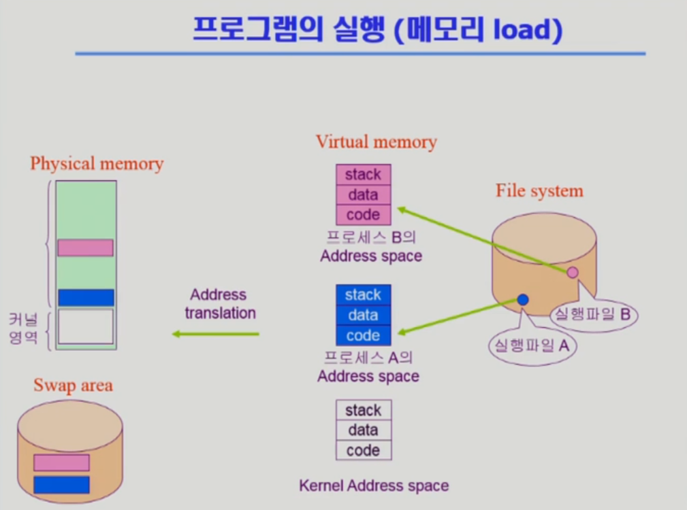

프로그램은 파일 형태로 파일 시스템에 저장되어있다. 프로그램이 실행되면 메모리에 올라가서 프로세스가 된다.

그 중간 단계가 virtual memory

프로그램이 실행될 때 각각의 프로그램은 독자적인 address space 가 있다.

필요한 부분만 물리적인 메모리에 올라가게되고 그렇지 않은 부분은 swap area 에 올라간다. 

메모리 주소

* virtual memeory
* physical memory

이 두 메모리 주소 사이의 address translation 이 필요하다.

* address space (프로그램의 virtual memory)
  * code : 실행 파일에 있는 기계어 code가 위치하는 부분 
  * data : 전역 변수
  * stack : 지역 변수, 함수 호출 시 사용되는 객체들
* kernel address space 도 code/data/stack 이 존재함

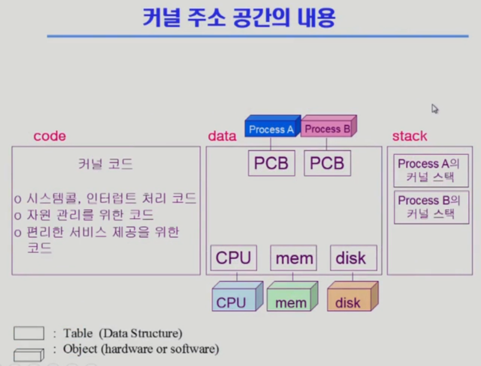

* 운영체제 data 영역에는 모든 하드웨어/프로세스를 관리하기 위한 자료구조를 가지고 있다.
  * PCB(Process Control Block) : 특정한 프로세스를 관리할 필요가 있는 정보를 포함하는 운영체제 커널의 자료구조

* 운영체제 stack
  * kernel 의 stack 은 각 프로세스마다 별도로 두고 있다.

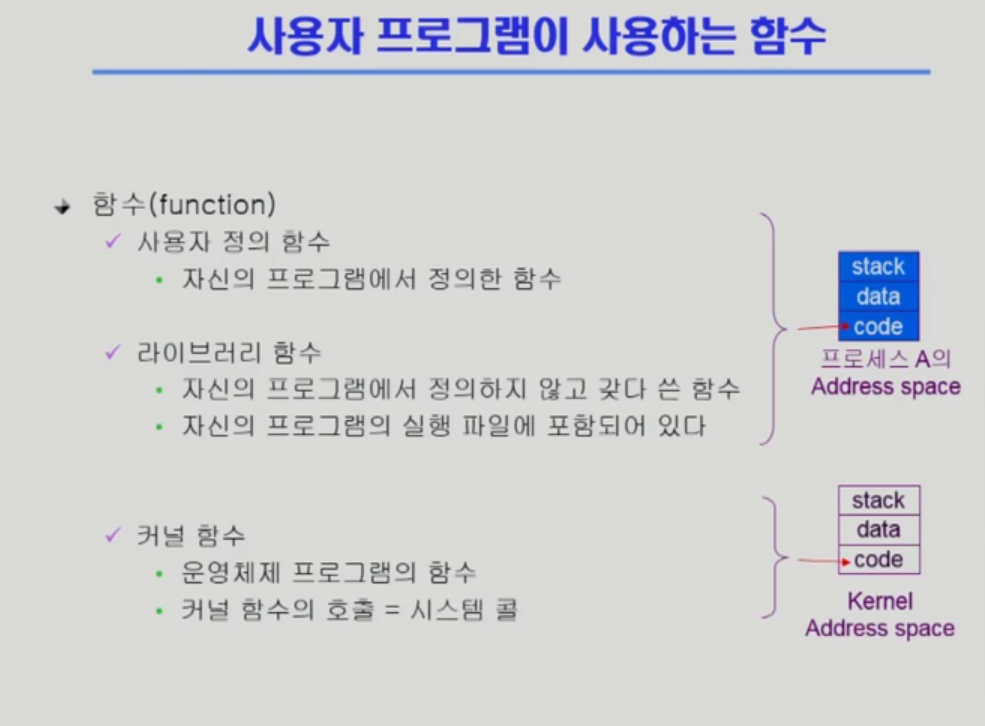

* 커널 함수
  * 프로그램 실행파일 안에 들어있는 것이 아니라 커널(kernel code) 안에 들어있음 (=시스템 콜)
  * 시스템콜 사용하기 위해 cpu 제어권을 프로세스에서 운영체제로 넘긴다.

CPU옆에는 mode bit이라는 것이 붙어있다.

mode bit 이 1 이면 user mode, 0이면 kernel mode

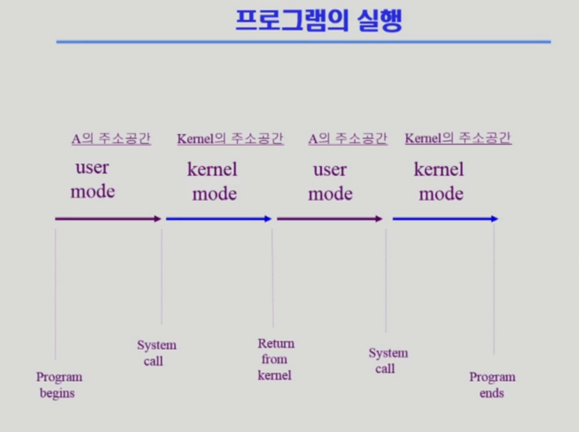

## 프로세스의 개념

* 프로세스 : 실행중인 프로그램
* 프로세스의 문맥(context) : 프로세스의 현재 상태
  * CPU 수행상태를 나타내는 하드웨어 문맥
    * Program Counter
    * 각종 register
  * 프로세스의 주소 공간
    * code, data, stack
  * 프로세스 관련 커널 자료 구조
    * PCB
    * Kernel stack

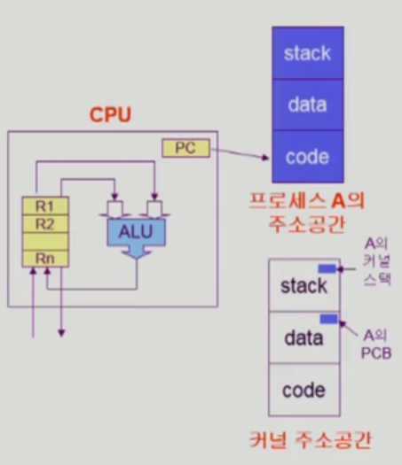

## 프로세스의 상태

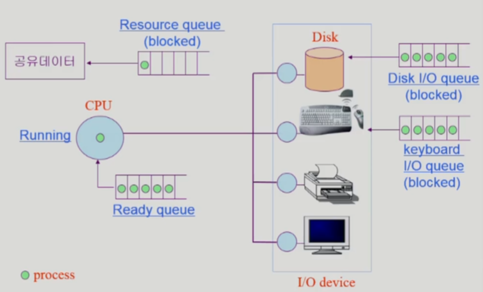

* 프로세스는 상태(state) 가 변경되며 수행된다.

  * Running : CPU 에서 실행중인 프로세스
    * CPU 를 잡고 instruction 을 수행중인 상태
  * Ready : 실행 대기 상태에 있는 프로세스
    * 메모리 등 다른 조건을 만족하고 CPU 를 기다리는 상태
  * Blocked : Disk I/O 같은 오래 걸리는 작업때문에 당장 수행할 수 없는 상태
    * CPU 를 주어도 당장 instruction 을 수행할 수 없는 상태
    * Process 자신이 요청한 event가 즉시 만족되지 않아 이를 기다리는 상태

  > New : 프로세스가 생성중인 상태
  >
  > Terminated : 수행(execution) 이 끝난 상태

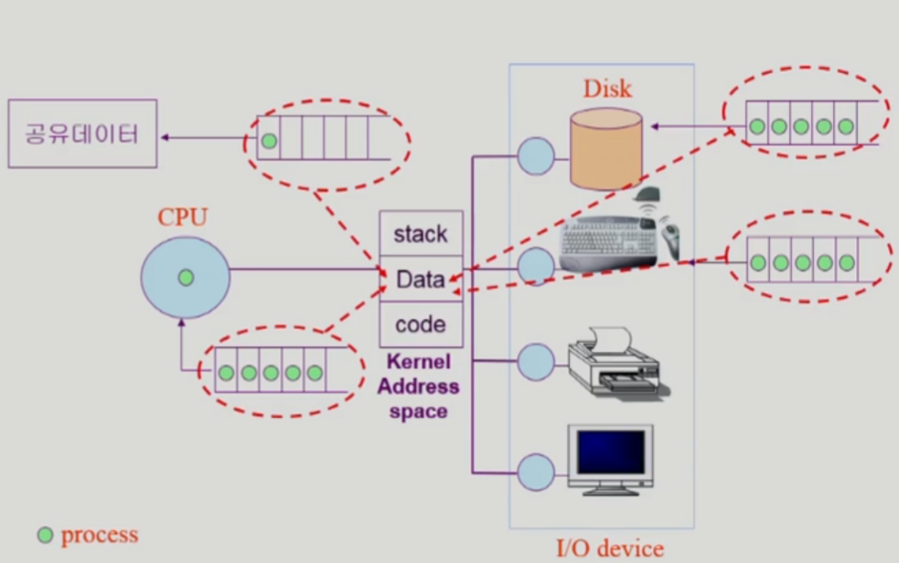

* 운영체제(kernel)가 data 영역의 PCB로 프로세스의 상태를 관리한다.

## 프로세스의 상태도

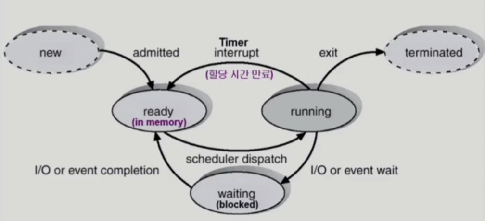

*  running 에서 상태 변하는 경우
  * Timer interrupt
  * I/O or event wait
  * exit

## Process Control Block(PCB)

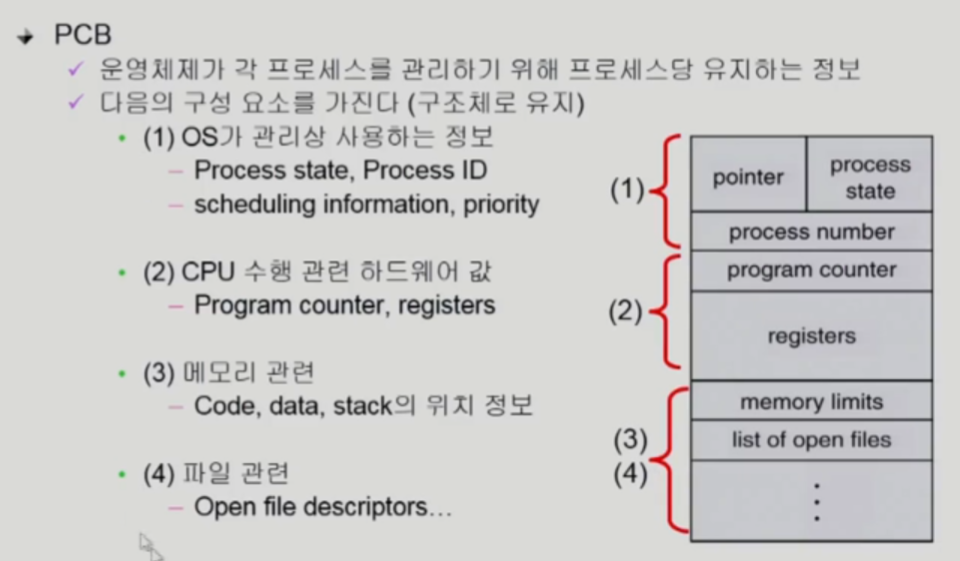

* OS가 관리상 사용하는 정보
  * Process state, PID, ...
* CPU 수행 관련 하드웨어 값
  * PC, registers
* 메모리 관련
  * code, data, stack 의 위치 정보
* 파일 관련
  * Open file descriptors

## Context Switch (문맥 교환)

* CPU 를 한 프로세스에서 다른 프로세스로 넘겨주는 과정
* CPU 가 다른 프로세스에게 넘어갈 때 운영체제는 다음을 수행
  * CPU 를 내어주는 프로세스의 상태를 그 프로세스의 PCB에 저장
  * CPU 를 새롭게 얻는 프로세스의 상태를 PCB 에서 읽어옴

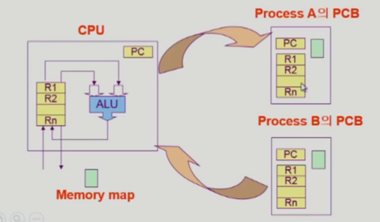

* ❗ System call 이나 Interrupt 발생 시 반드시 context switch 가 일어나는 것은 아님

  * (1) A가 실행되다가 다시 A가 실행 : 문맥교환이 아님
  * (2) A가 실행되다가 B 가 실행됨 : 문맥교환 발생

  > (1)의 경우에도 CPU 수행 정보 등 context 의 일부를 PCB 에 save 해야하지만, Context switch 가 발생한 (2) 의 경우 그 부담이 훨씬 큼

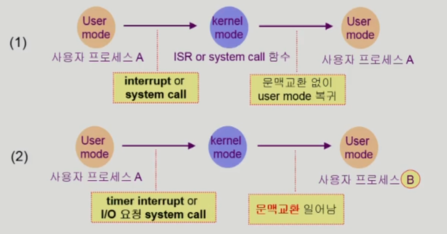

---

➕참고

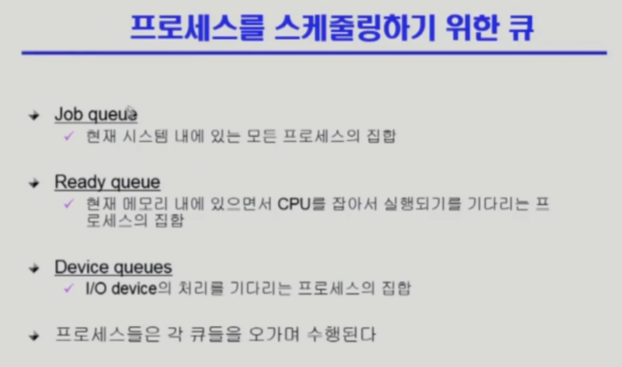

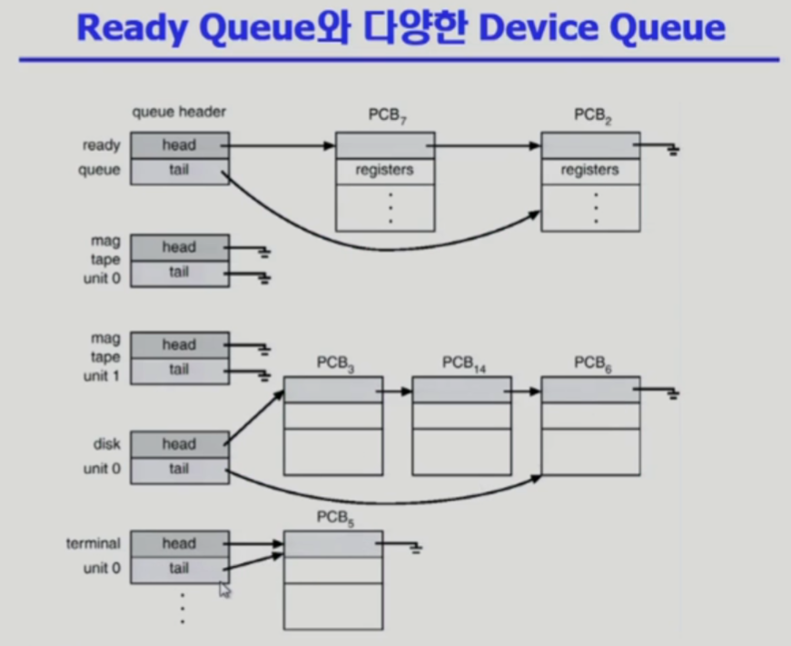

---

## 프로세스 스케줄링 큐의 모습

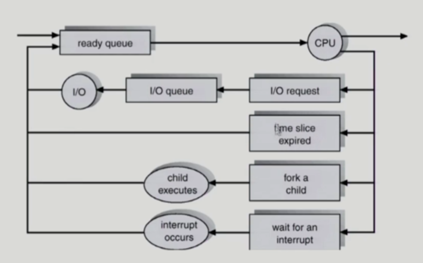

## 스케줄러 (Scheduler)

* 운영체제에서 스케줄링을 하는 코드를 스케줄러라고 한다. (=코드의 일부)
* Long-term scheduler
  * 프로세스 상태를 new에서 ready로 바꾸는 admitted 동작을 해준다.
  * 우리가 다루는 일반적인 운영체제는 보통 장기 스케줄러가 없다.
* Medium-Term Scheduler
  * 장기 스케줄러가 없는 대신 사용하는 스케줄러
  * 프로세스에게서 memory 를 뺏는다.

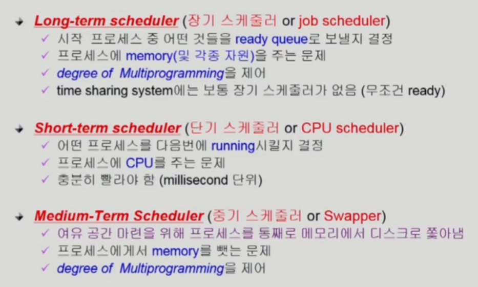

## 프로세스의 상태

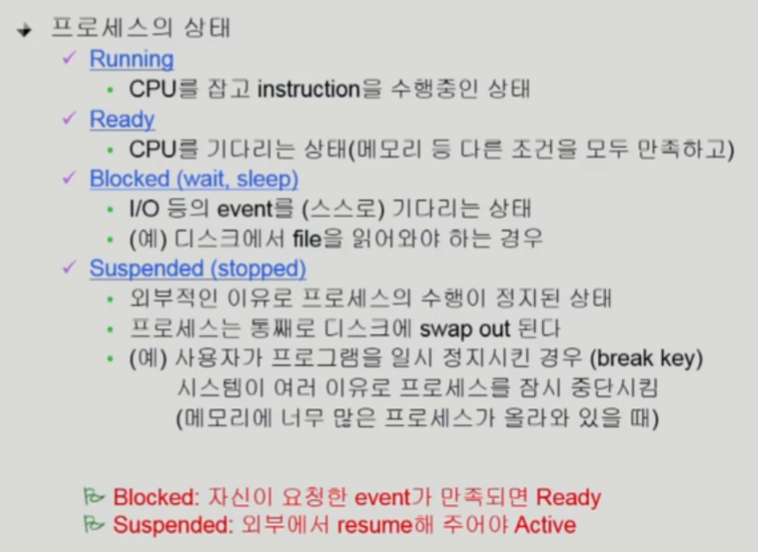

* Blocked 와 Suspended 모두 CPU 를 얻지 못한다.
  * Blocked : 요청한 event 끝나면 다시 ready 상태로 돌아감
  * Suspended : 일을 아예 못하고 있는 상태, 외부에서 resume 시켜줘야 상태 변화 가능

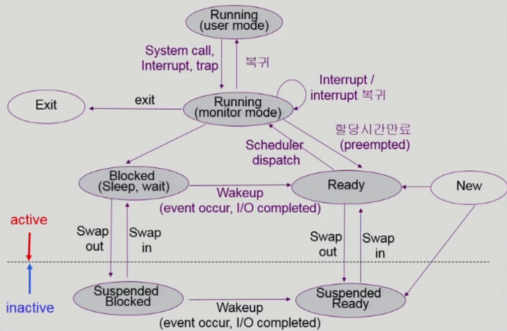

> usermode 와 kernel mode의 running 상태 확인하기
>
> 프로세스 상태 변화도 위의 그림 기준으로 공부할 것

## Thread

* Thread (=lightweight process)
  * 프로세스의 CPU 수행 단위
  * CPU 수행 부분 (PC, register, Stack) 만 별도로 가지고 있고, 나머지는 공유
* Thread 가 동료 Thread와 공유하는 부분
  * code
  * data
  * OS resources
* 전통적인 개념의 heavyweight process 는 하나의 thread 를 가지고 있는 task 로 볼 수 있다.

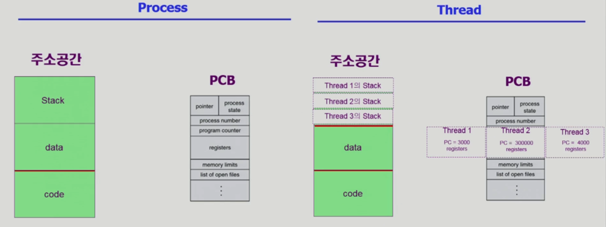

* single CPU 에서의 장점
  * **Responsiveness** : 다중 스레드로 구성된 태스크 구조에서는 하나의 서버 스레드가 blocked(waiting) 상태인 동안에도 동일한 태스크 내의 다른 스레드가 실행되어 빠른 처리를 할 수 있다.
  * **Resource Sharing** : 동일한 일을 수행하는 다중 스레드가 협력하여 높은 처리율(throughput) 과 성능향상을 얻을 수 있다.
  * **Economy** : Context switch 보다 overhead 가 적다.
* multi CPU (multi processor) 에서의 장점
  * **Utilization of Multi-Architectures** : 스레드를 사용하면 병렬성을 높일 수 있다.

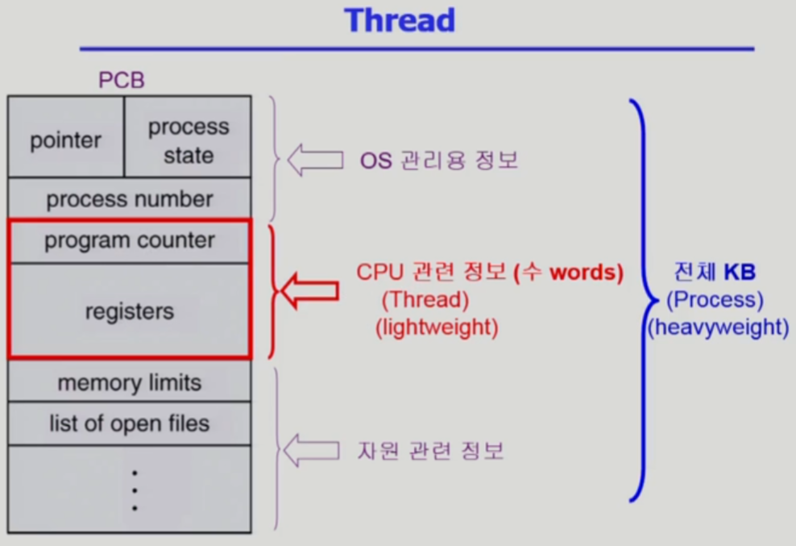

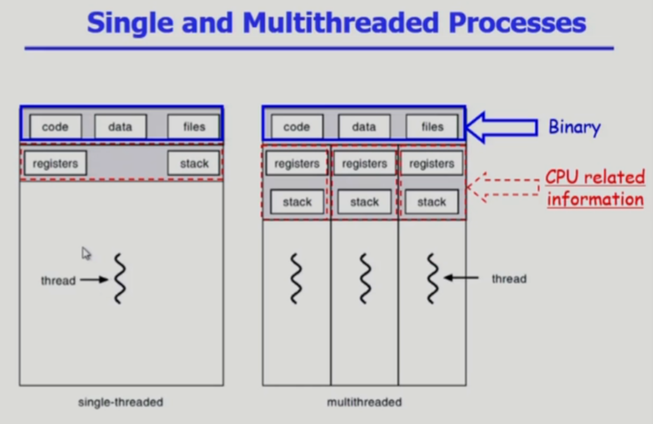

* thread 를 구현하는 방법에 따른 분류
  * Kernel Threads
    * 운영체제가 thread 의 존재를 아는 경우
    * 운영체제에서 thread 에게 직접 CPU 넘긴다.
  * User Threads
    * 운영체제가 thread 의 존재를 모르는 경우
    * 사용자 프로그램에서 thread 를 관리

## 프로세스 생성 (Process Creation)

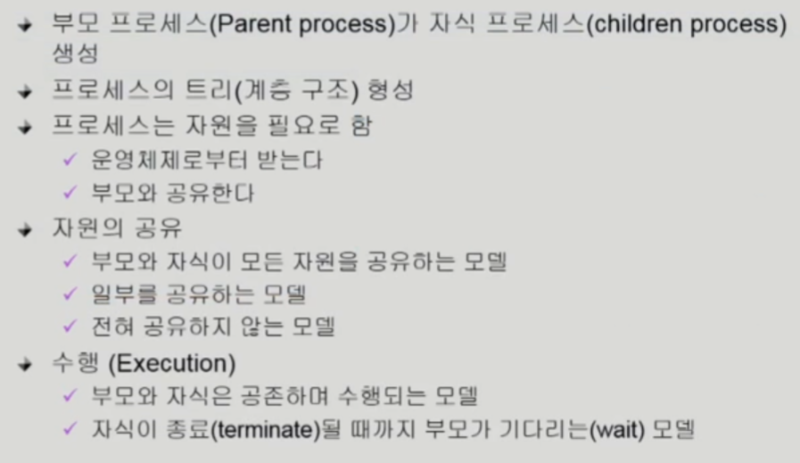

* 일반적으로 process 는 자원을 차지하기 위해 경쟁한다.

* 주소 공간 (Address space)

  * 자식은 부모의 공간을 복사함 (binary and OS data)

  * 자식은 그 공간에 새로운 프로그램을 올림

  * ***fork()*** 시스템 콜이 새로운 프로세스를 생성

    * 부모를 그대로 복사

    * 주소 공간 할당

    * fork() 다음에 이어지는 ***exec()*** 시스템 콜을 통해 새로운 프로그램을 메모리에 올림

      > fork 와 exec 의 차이점?

## 프로세스 종료 (Process Termination)

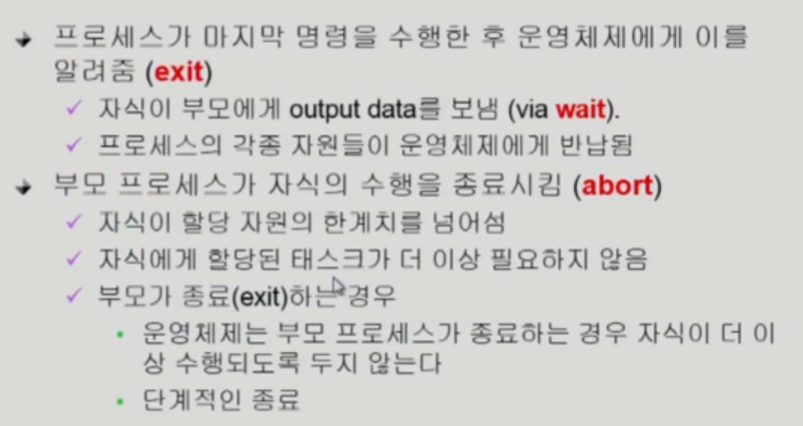

## fork()

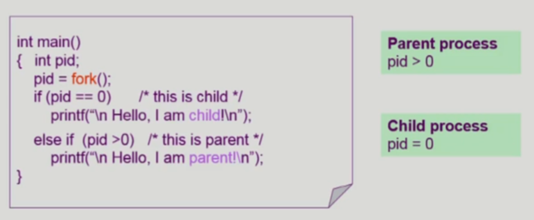

* 부모 프로세스는  fork() 다음 코드를 실행하고, 복제된 자식프로세스는 부모와 똑같이 fork() 다음부터 실행한다. (Program counter 도 복제하기 때문)
* fork() 는 프로세스의 pid를 리턴한다.
  * pid == 0 이면 자식프로세스
  * pid > 0 이면 부모 프로세스

## exec()

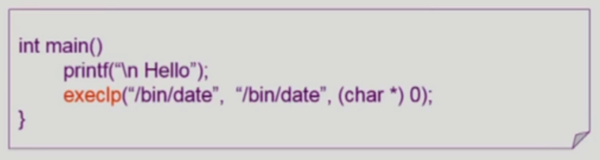

* Hello 를 출력하고 data 프로그램이 덮어 씌워진다.
* execpl 이후 코드는 실행되지 않는다.

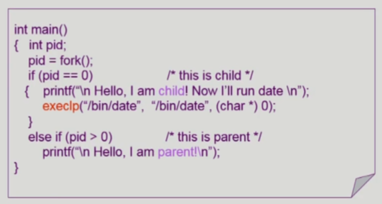

* 부모 프로세스는 기존 코드 실행하고, 자식프로세스는 execpl 통해 date 프로그램 덮어 씌워진다.
