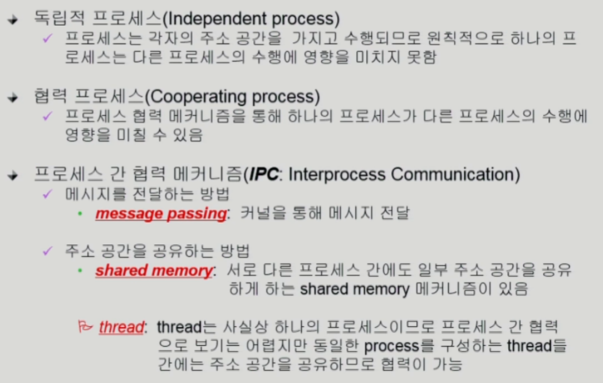
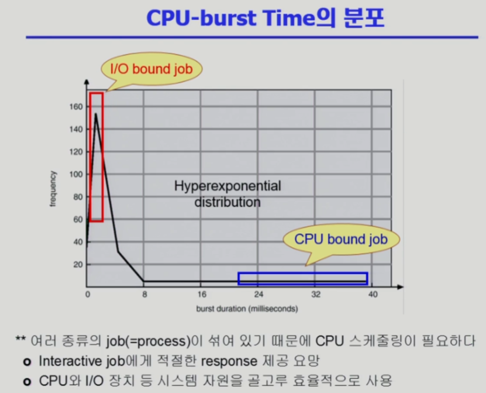
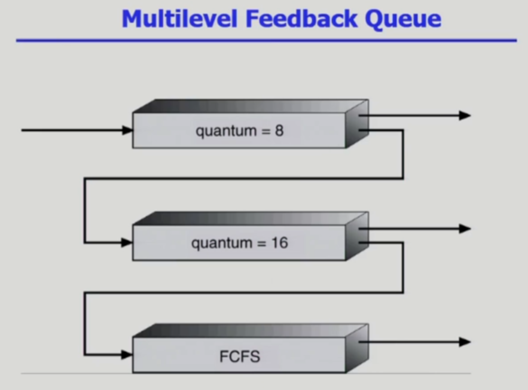

# 04. CPU 스케줄링

## 프로세스와 관련한 시스템 콜

* fork() : create a child

* exec() : overlay new image

* wait() : sleep until is done

  * 프로세스 A가 wait() 시스템 콜을 호출하면

    * 커널은 child 가 종료될 때 까지 프로세스 A를 sleep 시킨다.(block 상태)
    * child process 가 종료되면 커널은 프로세스 A를 깨운다. (ready  상태)

    

* exit() : free all the resources, notify parent
  * 모든 자원을 반납하고 부모 프로세스에게 알림
  * 자발적 종료
    * 마지막 statement 수행 후 exit() 시스템 콜을 통해
      프로그램에 명시적으로 넣어주지 않아도 main 함수가 리턴되는 위치에 컴파일러가 넣어줌
  * 비자발적 종료
    * 부모 프로세스가 자식 프로세스를 강제 종료시킴
      * 자식 프로세스가 한계치를 넘어서는 자원요청
      * 자식에게 할당된 태스크가 더이상 필요하지 않음
    * 키보드로 kill, break  (ex. ctrl+C) 등을 친 경우
    * 부모가 종료하는 경우
      * 부모 프로세스가 종료하기 전에 자식들이 먼저 종료됨

## 프로세스 간 협력

* 독립적 프로세스 (Independent process)
  * 프로세스는 각자 주소 공간을 가지고 수행되므로 원칙적으로 하나의 프로세스는 다른 프로세스의 수행에 영향을 미치지 못함
  * 프로세스는 항상 독자적으로 행동한다. 프로세스 B가 프로세스 A의 메모리 참조하지 못한다.
* 협력 프로세스 (Cooperating process)
* 프로세스 간 협력 메커니즘 (IPC : Interprocess Communication)
  * 메시지를 전달하는 방법
    * message passsing
  * 주소 공간을 공유하는 방법
    * shared memory
    * thread

### Message Passing

### IPC (Interprocess Communication)

* 원칙적으로 프로세스는 본인만의 code/data/stack 만 접근 가능
  * 운영체제에게 시스템콜을 통해 부탁해서 메모리의 일부 공유하는 방법
* 프로세스끼리 서로 신뢰할 수 있다는 전제하에 shared memory 사용해야 한다.

## 하나의 프로세스의 일생

* CPU burst : CPU 가 기계어를 실행
* I/O burst : I/O 를 실행

* 프로세스는 그 특성에 따라 두 가지로 나눔
  * I/O bound process : CPU 를 잡고 계산하는 시간보다 I/O 에 많은 시간이 필요한 job
  * CPU bound process :  계산 위주의 jop

## CPU scheduler & Dispatcher

* 운영체제 코드의 일부 (SW)

* CPU Scheduler

  * Ready  상태의 프로세스 중에서 이번에 CPU 를 줄 프로세스를 고른다.

* Dispatcher

  * CPU 의 제어권을 CPU 스케줄러에 의해 선택된 프로세스에게 넘긴다.
  * 이 과정을 context switch 라고 한다.

* CPU 스케줄링이 필요한 경우는 프로세스에게 다음과 같은 상태 변화가 있는 경우이다.

  

## Scheduling Crieteria (성능 척도)

* turnaround time
  * CPU를 사용하는 시간 + CPU를 기다리는 시간
* 대기 시간
* 
  * CPU 를 쓰러와서 기다린 전체시간 (기다린 시간의 합)
* 응답시간
  * 프로세스가 CPU 를 쓰러 들어와서 최초로 얻게 되기까지 걸리는 시간
  * CPU burst 에 들어와서 최초로 CPU 를 얻게되기까지

---

## Scheduling Algorithms

### FCFS (First-Come First-Served)

* convoy effect : 소요시간이 긴 프로세스가 먼저 도달하여 시간을 잡아먹고 있는 부정적인 현상

---

### SJF (Shortest-Job-First)

* 각 프로세스의 다음번 CPU burst time 을 가지고 스케줄링에 활용
* CPU burst time이 가장 짧은 프로세스를 제일 먼저 스케줄
* priority scheduling의 일종
* 두가지 방법
  * **Nonpreemptive** : 일단 CPU를 잡으면 이번 CPU burst가 완료될 때까지 CPU 를 선점당하지 않음
    
  * **Preemptive** : 현재 수행중인 프로세스의 남은 burst time 보다 더 짧은 CPU burst time을 가지는 새로운 프로세스가 도착하면 CPU 를 빼앗김 (=SRTF, Shortest-Remaining-Time-First)
    
* SJF is optimal
  * 주어진 프로세스들에 대해 minimum everage waiting time 을 보장
* SJF의 약점
  * starvation 발생 가능 (-> 해결 방법 : aging)

> 참고
>
> 
>
> 

---

### RR (Round Robin)

* 각 프로세스는 동일한 크기의 할당 시간(time quantum)을 가짐 (일반적으로 10-100msec)

*  **할당 시간이 지나면 프로세스는 선점 (preempted) 당하고 ready queue 의 제일 뒤에 가서 다시 줄을 선다.**

* n개의 프로세스가 ready queue 에 있고 할당 시간이 **q time unit** 인 경우 각 프로세스는 최대 q time unit 단위로 CPU 시간의 1/n 을 얻는다.

  * ***어떤 프로세스도 (n-1)q time unit 이상 기다리지 않는다.***

* Performance

  * q large => FCFS

  * q small => context switch 오버헤드가 커진다.

    

* SJF 보다 평균 소요시간 길지만 응답시간은 더 짧다.

---

### Multilevel Queue

* Ready queue 를 여러개로 분할

* 각 큐는 독립적인 스케줄링 알고리즘을 가짐

* 큐에 대한 스케줄링이 필요

  * starvation 발생 가능성 높음

    -> Time slice를 통해 각 큐에 CPU time을 적절한 비율로 할당

---

### Multilevel Feedback Queue

* 프로세스가 다른 큐로 이동 가능
* aging 을 이와 같은 방식으로 구현할 수 있다.
* ex)

---

### Multi-Processor Scheduling

* CPU 가 여러개인 경우 스케줄링은 더욱 복잡해진다.

---

### Real-Time Scheduling

* Hard real-time systems
  * Hard real-time task 는 정해진 시간안에 반드시 끝내도록 스케줄링 해야함
* Soft real-time systems
  * Soft real-time task 는 일반 프로세스에 비해 높은 priority 를 갖도록 해야 함

---

### Thread Scheduling

* Local Scheduling
  * User level thread 의 경우 사용자 수준의 thread library 에 의해 어떤 thread 를 스케줄할지 결정
* Global Scheduling
  * Kernel level thread 의 경우 일반 프로세스와 마찬가지로 커널의 단기 스케줄러가 어떤 thread 를 스케줄할지 결정

---

## Algorithm Evaluation

어떤 CPU 스케줄링 알고리즘이 더 좋은지 평가하는 방법

* Queueing models

  * 확률 분포로 주어지는 arrival rate 와 service rate등을 통해 각종 performance index 값을 계산

  * 아래 그림의 server 를 CPU 라고 보면 된다.

    

* Implementation (구현) & Measurement (성능 측정)

  * 실제 시스템에 알고리즘을 구현하여 실제 작업(workload)에 대해서 성능을 측정 비교

* Simulation (모의 실험)

  * 알고리즘을 모의 프로그램으로 작성 후 trace 를 입력으로 하여 결과 비교