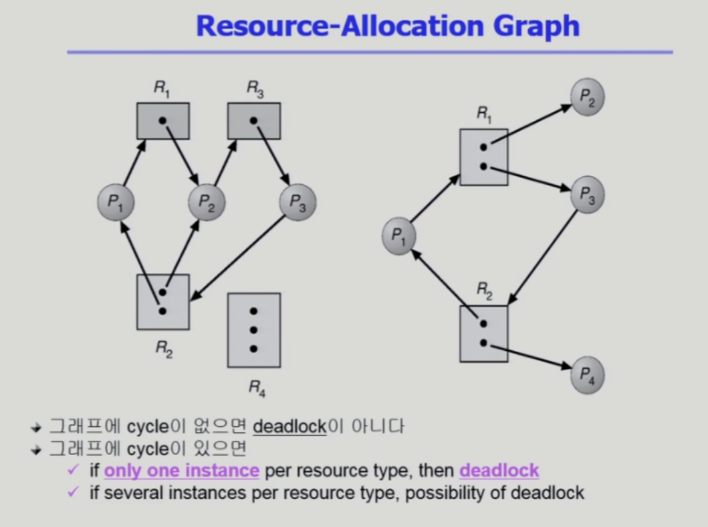

# 07. 데드락 (Deadlocks)

## 목차

- [Deadlock 발생의 4가지 조건](#deadlock-----4-----)
  * [자원할당 그래프](#--------)
- [Deadlock의 처리 방법](#deadlock-------)
  * [Deadlock Prevention](#deadlock-prevention)
  * [Deadlock Avoidance](#deadlock-avoidance)
    + [Resource Allocation Graph algorithm](#resource-allocation-graph-algorithm)
    + [Banker's algorithm](#banker-s-algorithm)
  * [Deadlock Detection and recovery](#deadlock-detection-and-recovery)
    + [Detection](#detection)
    + [Recovery](#recovery)
  * [Deadlock Ignorance](#deadlock-ignorance)


* P0 는 A를 얻고 B를 기다림, P1는 B를 얻고 A를 기다림
* 프로세스가 자원을 사용하는 절차
  * 요청
  * 할당
  * 사용
  * 해제

## Deadlock 발생의 4가지 조건

> 💡 운영체제 상식으로 자주 나오는 문제
>
> 다음 4가지 조건을 모두 만족해야 deadlock이 발생한다.


### 자원할당 그래프

* 프로세스와 자원의 관계를 그래프로 표현
* R -> P : 자원 R을 프로세스 P 가 점유하고 있다.
* P -> R : 프로세스 P가 자원 R을 기다리고 있다.




* 그래프에 사이클이 없으면 deadlock 이 아니다.
* 그래프에 사이클이 있으면
  * 자원이 1개밖에 없는 경우 deadlock
  * 자원의 인스턴스가 여러개인 경우 deadlock이 아닐 수도 있다.

## Deadlock의 처리 방법


* 예방
  * Deadlock Prevention
  * Deadlock Avoidance
* recover
  * Deadlock Detection and recovery
* 아무것도 안함
  * Deadlock Ignorance

### Deadlock Prevention


### Deadlock Avoidance

* **프로세스들의 자원별 최대 사용량을 알고있다는 가정**하에 사용되는 방법


* safe sequence 가 존재한다.
  * 가용자원 + 보유자원에 의해 프로세스의 모든 자원 요청을 처리할 수 있는 경우


* 자원이 하나의 인스턴스 가지고 있는 경우
  * Resource Allocation Graph algorithm
* 자원이 여러개의 인스턴스 가지고 있는 경우
  * Banker's algorithm

#### Resource Allocation Graph algorithm


* 실선 : 평생에 한번 이상 요청할 가능성 있음
* 점선 : 해당 자원을 요청함

* 점선을 포함해서 사이클이 만들어질 수 있는 가능성이 있기 때문에 P1 프로세스에게 자원을 주지 않음
  * 언제까지? (P2가 자원을 반납해서) 더이상 사이클이 생기지 않을 때까지

#### Banker's algorithm


* Allocation : 현재 할당된 자원
* Max : 프로세스 별 최대 자원 사용량 (최대 요청량)
* Available : 아무도 쓰지않는 가용자원
* Need : 최대 자원 사용량에서 현재 할당된 자원의 수를 뺀 것

```
만약 P0이 C를 요청하면? P0의 C Need값은 3이고 C의 가용자원은 2이므로 자원을 주지 않는다.
만약 P1이 A,B,C 요청하면? P1의 Need값이 1,2,2 이고 가용자원은 3,2,2이므로 자원을 할당한다.
```

* 항상 safe state를 유지
  * P1은 모든 Need 에 대한 자원 할당받아 일 끝내면 자원 반환 -> available은 6,5,4가 된다.
  * P3이 모든 Need 에 대한 자원 할당받아 일 끝냄..
  * ....
  * P1, P3, P4, P2, P0 순서로 안전하게 자원 할당하여 프로세스 종료할 수 있는 시퀀스가 존재하면 시스템은 safe 하다고 할 수 있음

### Deadlock Detection and recovery

* 데드락이 자주 생기는 상황이 아니므로 CPU 성능을 위해 여유자원이 있으면 무조건 준다.

* 데드락 발생은 허용하되 detection -> recovery 


#### Detection


* 자원의 인스턴스가 한개인 경우
* wait-for graph 사용 : 사이클이 존재하는지(deadlock detection) 더 쉽게 확인 가능


* 자원의 인스턴스가 여러 개인 경우
  * Banker's algorithm 과 유사한 방법 활용
  * 시퀀스가 존재 -> 현재 데드락이 존재하지 않음

#### Recovery


* Process termination
  * 데드락이 걸린 모든 프로세스 죽이는 방법
  * 데드락이 걸린 프로세스를 하나씩 죽이는 방법
* Resource Preemption
  * 비용이 최소화되는 victim의 자원을 빼앗음
  * starvation 문제
    * 비용과 rollback 횟수 같이 고려해야 함

### Deadlock Ignorance

