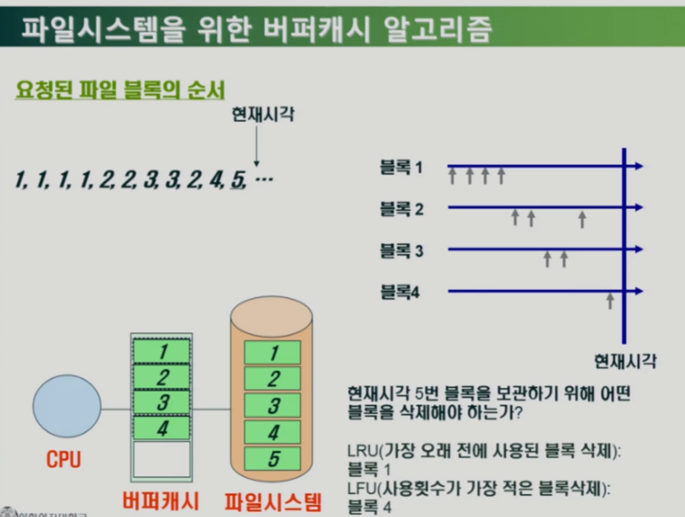

# 11. 입출력 시스템

## Disk Scheduling

* cylinder : 하드디스크를 구성하고 있는 모든 원판 상에 위치하고 있는 단일 트랙 위치(같은 트랙번호를 갖는 각 면에 있는 트랙들의 집합)

### Disk Structure

* logical block : 디스크 외부에서 보는 디스크의 단위 정보 저장 공간들
* sector : 하드 드라이브의  최소 기억 단위
* 디스크 내부에서는 디스크 컨트롤러가 원판, 트랙, 섹터번호 알려줘야 데이터 찾을 수 있다.
* 디스크 외부에서는 logical block 번호 이용하여 데이터를 찾는다.

### Disk Management

* physical formatting : 디스크 컨트롤러가 디스크를 섹터 단위로 나누는 과정
  * 디스크를 만들고 처음으로 하는 과정
  * 섹터는 header + (실제)data + trailer 로 구성
  * header/trailer : 컨트롤러가 디스크를 관리하기 위한 정보
* partitioning : 디스크를 논리적인 디스크로 나누는 과정
  * C드라이브, D드라이브...
* Logical formatting : 파티셔닝한 논리적 디스크에 파일 시스템을 설치하는 것
* Booting
  * ROM : 전원을 꺼도 데이터가 사라지지 않는 메모리
  * small bootstrap loader 를 실행 (-> 디스크의 0번 sector를 load해라)

### Disk Scheduling

* Access time
  * Seek time : 헤드를 해당 실린더로 움직이는데 걸리는 시간
  * Rotational latency : 헤드와 섹터가 만나기까지 걸리는 회전지연시간, seek time 의 1/10 정도 걸림
  * Transfer : 실제 데이터의 전송시간, seektime에 비해 굉장히 작은 시간
  * 디스크를 효율적으로 관리하려면 헤드의 이동 거리를 줄이는 것이 중요
* Disk bandwidth (대역폭) : 단위 시간당 전송된 바이트의 수
  * bandwidth 를 높이기 위해 disk scheduling을 잘해야한다.
* Disk Scheduling : **seek time을 최소화 하는것이 목표**

## Disk Scheduling Algorithm

* 큐에 다음과 같은 실린더 위치의 요청이 존재하는 경우 디스크 헤드 53번에서 시작한 각 알고리즘의 수행 결과는 ? (실린더 위치는 0-199)
  * 98, 183, 37, 122, 14, 124, 65, 67

### FCFS (First Come First Served)

* 선착순 처리
* 헤드의 이동 상당히 빈번

### SSTF (Shortest Seek Time First)

* 현재 위치부터 seek time이 가장 작은 요청부터 우선 처리
* head의 이동거리는 짧아질 수 있지만 starvation 의 문제가 있다.

### SCAN⭐

* disk scheduling 에서 가장 핵심적인 방법
* head가 한쪽 끝에서 다른쪽 끝으로 이동하며 처리할 수 있는 모든 요청을 처리하고 지나간다.

### C-SCAN

* 디스크 헤드가 한쪽 끝에 도달하면 바로 출발점으로 다시 이동

### Other Algorithms

* Look : 가려는 방향에 더이상 요청없으면 바로 턴

* 디스크 스케줄링 알고리즘은 OS 와 별도의 모듈로 작성되어야 한다.

## Swap-space Management

* Swap-space
  * 전원을 끄면 사라질 정보들이기 때문에 공간 효율성보다는 속도 효율성이 우선
  * 헤드의 이동 줄이기 위해 큰 단위로 데이터를 읽고 쓴다.

## RAID

* 신뢰성 향상
  * 데이터를 서로 다른 디스크에 중복 저장
  * 완전 중복 저장을 하면 공간 낭비가 심하므로 최소한의 중복을 통해 신뢰성을 높일 수도 있다.
    * parity : 일종의 축약된 정보

## UNIX 파일 시스템

* 파일 시스템 구성 : super block + i-node block + data block
  * i-node block 하나에는 i-node 여러개가 들어간다.

---

(참고. 파일시스템의 변천사)

---

## Ext2 파일 시스템

* 데이터를 15개의 포인터 블록으로 구성
  * 12 Direct ptr : 직접 데이터를 가리킴
  * 3 Indirect ptr : 큰 file 표현 시 사용

* 블록의 그룹화
  * 각각의 그룹에 메타 데이터와 실제 데이터를 같이 배치 -> 디스크 헤드의 이동시간 줄임
* 수퍼블록을 그룹마다 중복 저장하여 디스크 오류(배드 섹터)에 대비

* inode table / data block : 실제 아이노드와 데이터가 저장되는 위치

* Ext2와 Ext4의 구조는 거의 동일
* Ext4는 여러 플랫폼에서 사용되고 있다.
* 저널링??

## 저널링 (Journaling)

* 전원이 나가면 버퍼캐시 내용이 휘발된다.
* 재부팅하면 파일시스템에는 Inconsistent data만 남는다. (깨진 데이터)

* journaling
  * 수정된 내용을 주기적으로 저널영역에 기록

### Ext4의 저널링

* 메타데이터 저널링 모드

  * 체크 포인팅 주기가 오면 journal area의 메타데이터를 파일 시스템에 반영한다.

  * 메타데이터에는 파일 시스템의 구조정보(위치정보)가 있다. 

  * 메타데이터를 저널링하면 파일 시스템 자체가 깨어지는 것 방지할 수 있지만, 일반 데이터는 깨질 수 있는 가능성이 존재한다.

* 데이터 저널링 모드
  * 파일 시스템뿐 아니라 데이터도 깨지지 않는다.

## 버퍼캐시 교체 알고리즘

* LRU 단점 : 자주 사용되는 블록에 대한 고려 X
* LFU 단점 : 사용횟수만 고려하고 최근 사용된 블록에 대한 고려 X

### LRFU 알고리즘

* 각각의 block 에 대해 value를 계산하고 그 값이 가장 작은 블록을 버퍼캐시에서 삭제
* LFU 적 성질 : 사용 횟소가 많으면 value 가 커지게 된다.
* LRU 적 성질 : 최근 사용된 블록일 수록 value 의 증가에 더 큰 기여

* 실효성
  * Space overhead
  * Time overhead

* 아무리 시간이 흐르더라도 시간정보 t 만으로 계산이 가능하다. 모든 block 정보 가지고있을 필요 없어서 space overhead 해결 가능

* 블럭들이 재사용되지 않는 이상 value의 대소관계 변하지 않는다.
* Heap 을 이용하여 구현

* 지금은 LRFU 보다 성능 좋은 알고리즘도 많다.
* LRFU : LRU 와 LFU 의 단점 보완하면서 효율적으로 구현할 수 있는 알고리즘
