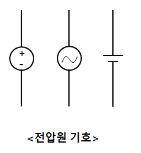
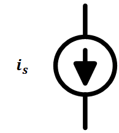
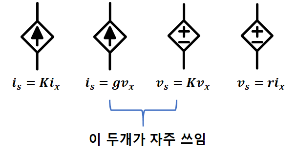

# (전기)회로 - circuit
## 1. 회로에 대한 기본 개념
### 1.기본 개념
> 회로 : 회로 소자 를 도선으로 연결한것
### 2.단위
#### 기본 단위
* 전압 (***V***, Volt) : 전기 회로에서 전류를 흐르게 하는 힘
* 전류 (***A***, Ampere) : 전하의 흐름
* 저항 (***Ω***, Ohm) : 전류의 흐름을 방해하는 정도
* 전력 (***W***, Watt) : 단위 시간당 소비되거나 생산되는 에너지
---
#### 부품 및 특성 단위
* 전하량 (***C***, Coulomb) : 전기의 기본 단위로, 전자의 양
* 주파수 (***Hz***, Hertz) : 1초 동안 진동, 반복되는 횟수
* 정전 용량(***F***, Farad) : 캐패시터가 전하를 저장하는 능력
* 인덕턴스 (***H***, Henry) : 코일(인덕터)이 전류의 변화에 저항하는 정도
* 컨덕턴스 (***S***, Siemens) : 저항의 역수로, 전류가 얼마나 잘 흐르는지
* 임피던스 (***Ω***, Ohm) : 회로에서 전류의 흐름을 방해하는 총 저항
``이때는 저항, 인덕턴스, 정전 용량등 모든 것을 포함``
---
#### 전력 및 에너지 단위
* 전력량 (***J***, Joule) : 소비된 총 에너지 양. $ 1J = 1W \times 1s$
* 유효 전력 (***W***, Watt) : 회로에서 실제로 부하에 의해 소비되는 전력
* 피상 전력 (***V A***, Volt-Ampere) : 회로에서 전압과 전류의 곱으로, 유효 전력과 무효 전력의 백터 합
* 무효 전력 (***var***, Volt-Ampere Reactive) : 회로에서 실제로 일로 변환되지 않고 회로 내에서 오가는 전력
---
#### 자주 쓰이는 단위
* $10^{12}$ : T, 테라
* $10^9$ : G, 기가
* $10^6$ : M, 메가
* $10^3$ : K, 키로
 
* $10^{-3}$ : m, 밀리
* $10^{-6}$ : u, 마이크로
* $10^{-9}$ : n, 나노
* $10^{-12}$ : p, 피코

### 3.전하 와 전류
> 전하(electric charge) : 전자기장내 전기현상을 일으키는 주체적인 원인
> 단위 : Coulamb [***C***]
> 기호 : ***Q***, ***q(t)*** - $q(t) = \int_{t1}^{t2}i(t)dt$ - 갯수임
> >$ e=-1.6\times^{-19}Coulamb $ - 최소
#### 원자의 구성
* 원자핵
    * 중성자 : 전기적으로는 무게만 담당
    * 양성자 : 중성자와 마찬가지로 무게도 있지만 +극성(양성)을 띄게 만들어줌
* 전자 : 안정적인 상태에선 양성자의 갯수와 동일한 전자들이 원자핵의 주변에 존재
    * 양이온 : 원자에 전자가 부족한 상태
    * 음이온 : 원자에서 떨어저 나간 전자

#### 전류
> 전류 : 전하의 흐름
> 단위 : Ampere [***A***]
> 기호 : ***I***, ***i***, ***i(t)*** - $i(t) =\frac{t}{dt}q(t)$
>> $Q = 1C$ 일때 단위 시간(1sec) == $1A$

* **직류(DC)** : 시간에 따라 크기가 변하지 않는 전류
* **교류(AC)** : 시간에 따라 크기가 변하는 전류
    * 정형파 신호
    * 사각파 신호
    * 삼각파 신호
    * ㆍㆍㆍ
> 전류의 평균값이 0이 될때 직류 성분을 띈다고 함

#### 전압
> 전압 : 단위 전하량의 위치에너지 차
> 단위 : Voltage [***V***]
> 기호 : ***V***
>> 1 volt : 1coulam의 전하를 옮기는 필요한 에너지 (1 joule)
>> $W = V \times Q$
>> $J = V \times C$

#### 전력 과 에너지
> 전력 : 단위 시간당 에너지(Joule) $\frac d{dt}W=P$, $W=V\times Q$, $P=V\times I$, $W = P\times T$(주로 시간은 hour)
> 단위 : [Watt], [W]
> 기호 : $P$
>> $1Wh == 60(sec) \times 60(min) Joule$

### 4.회로 소자
> 저항, 전압원, 전류원이 기본
> **전압원**과 **전류원**을 통합해서 말하는게 **전원**
> - 우측에는 단자수
* **저항** - 2
* **전압원** - 2
* **전류원** - 2
* **축전기**
* **유도기**
* **다이오드**
* **트랜지스터**
* **변압기**
* **증폭기**
* ㆍㆍㆍ

#### 회로 해석(계산)법
회로를 푼다는건 그 회로의 흐르는 **전류**, 걸리는 **전압**을 구하는것
* **환경식** : 해당 회로 소자가 구성된 환경에 의해 만들어지는 식
    * 루프 방정식
    * 노드 방정식
    * ㆍㆍㆍ
* **특성식** : 해당 회로 소자의 특성에 따라 만들어 지는식

#### 저항

> $1Ω = 1V / 1A$

**특성식 :** $V = I\times R$ - ohm의 법칙
저항(R) 에서는 전력(P)이 **소모**되기만 함 -> 항상 양수
- $P =V\times I \rightarrow I^2R$ 또는 $\frac {V^2}R$
  

#### 전원
* **독립 전원** : 크기를 자신이 결정
* **종속 전원** : 다른 소자에 의해 크기가 결정

##### 독립 전원

> 독립은 기호를 동그라미로 표기

**특성식 :** $V = V(n값)$, $I = I(n값)$

##### 종속 전원

> 종속은 기로를 마름모로 표기
> 해당 사진은 전류원도 같이 들어감

**특성식 :** $V = v$, $V = i$, $I = v$, $I = i$

### 예제
1. $q(t) = 10sin2\pi t[mC]$ 일때 $i(t)$를 구하시오.
 
### 키포인트
**전압**, **전류**를 먼저 구하고 나머지 값들을 구하는식으로 가자 