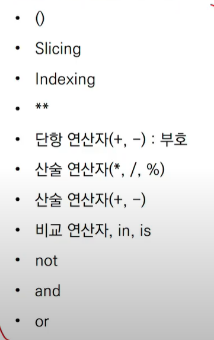

# 파이썬


### 파이썬 변수

컴퓨터 메모리 어딘가에 저장되어 있는 객체를 참조하기 위해 사용되는 이름

* **할당 연산자(=)**를 통해 **값**을 할당
* **type()** : **자료형이름**을 반환
* **id()** : 변수에 할당된 값(객체)의 고유값 즉 **메모리 주소**를 반환

```
ex) dust           =          60

    변수명       할당연산       값
```


### 파이썬 변수 연산

* 변수(숫자) 연산자 변수(숫자) = 숫자, 단 /연산자를 사용하면
* 문자 연산자 변수(문자) = 문자
* 변수(문자) 연산자 숫자 = 문자
* 

```
ex)
i, j = 1, 2
i + j --> 3

i='Hello'
i + 'World' --> 'Hello World'
i * 3 --> 'HelloHelloHello'
```


### 변수 할당

* **같은 값을 동시에 할당**
  * x = y = 100
  * print(x, y) --> 100 100


* **다른 값을 동시에 할당**
  * x, y = 1, 2
  * print(x, y) --> 1 2


* **특이한 방법**
  * **스왑**
  * x, y = 10, 20
  * x, y = y, x
  * print(x, y) --> 20 10


### 식별자

#### 규칙

영문알파벳, 언더스코어(_), 숫자 로 구성

첫글자에 숫자불가

길이제한x 대소문자 구별

몇몇개의 키워드는 예약어로 존재하여 사용불가


기존 내장함수에다가 다시 할당을 해버리면 기존 내장함수를 사용 할 수 없다.

복귀 하고 싶다면 del 할당되버린_변수명

ex

print(5)

print = 'hi'

--여기

print(5)


### 사용자 입력

* input()
  * 사용자로부터 값을 즉시 입력받는 메소드
  * 반환값은 항상 문자열


### 이름 작성요령

* RedApple - 낙타식
* red_apple - 뱀식


### 주석

* '#' 한줄 주석
* ''' or """ 여러줄 주석
* docstring 특이한 주석
* __doc__ 이부분이 주석


### 자료형(Data Type)

* Boolean Type

​	참, 거짓

​	0-->False 1, -1-->True

0, 0.0, (), [], {}, '', None  ->  False

' ' --> True


* Numeric Type

  * **Int** : 모든 **정수**타입은 Int 

    다른언어에서는 여러가지 정수타입이 있지만 여기선 없고

    매우 큰수가 나와도 오버플로우가 발생x

    임의 정밀도 산술 하기때문.

    고정크기가 아닌 가변크기

    

    | 2진수 | 8진수 | 16진수 |
    | :---: | :---: | :----: |
    | 0b00  | 0o00  |  0x00  |

    

    

  * Float : 정수가 아닌 모든 **실수**타입은 float

    실수 표현방식 2진수로 표현.

    이 과정에서 floating point rounding error가 발생해서 예상치 못한 결과 발생

    floating point rounding error

    부동소수점에서 실수 연산 과정에서 발생 가능

    ex) 3.14 - 3.02 == 0.12 --> Flase

     3.14 - 3.02 --> 0.120000000000001 이런식으로 나옴

    값 비교시 실수라면 주의 

    혹은 math.isclose()를 사용해서 비교

    지수표현 주의

  

  * Complex

    실수와 허수부로 구성 허수부는 j로 표현

* String Type

  모든 문자는 **str**타입 

  문자열은`'`나 `"`로 감 싸서 사용

  * Immutable
  * literlable
  * 중첩 따옴표
  * ''' ''' 로 감싸서 사용

| 예약문자 | 내용        |
| -------- | ----------- |
| \n       | 줄 바꿈     |
| \t       | 탭          |
| \r       | 캐리지 리턴 |
| \0       | None(Null)  |
| \\\\     | `\`         |
| \\'      | `'`         |
| \\"      | `"`         |

* String Interpolation
  * 문자열을 변수로 활용
  * %-formating
  * str.format()
  * f-strings : python 3.6+

```
print('Hello, %s' % name)
print('내 성적은 %d' % score)
print('내 성적은 %f' % score)

print('Hello, {}'.format(name))


```

​		f-stirng


		* None Type


### 컨테이너

여러개의 값을 담을수 있는 개체. 서로 다른 자료형을 저장가능

ex) list, tuple


컨테이너 분류

* 순서가 있는 데이터(시퀄스형)

  * 리스트 (가변)

    순서를 가지는 0개 이상의 객체를 참조하는 자료형

    가변형

    []형태로 출력

    [ 1, 2, 3, 4]

      0  1  2  3 인덱스

     -4 -3 -2 -1 

  * 튜플 (불변)

    수정 불가능한 시퀀스. 인덱스로 접근가능

    ()형태로 출력

    일반적으로 파이썬 내부에서 주로 사용되고 

    사용자는 주로 리스트를 사용하고 튜플을 잘 쓰지는 않음

    ()가 생략이 가능하다

    

  * 레인지

    ```
    기본형 : range(n)
    		0부터 n-1까지의 숫자의 시퀀스
    
    범위 지정 : range(n, m)
    		n부터 m-1까지의 숫자의 시퀀스
    		
    범위 및 스텝 지정 : range(n, m, s)
    		n부터 m-1까지 s만큼 증가시키는 숫자의 시퀀스
    ```

    

* 순서가 없는 데이터(비시퀀스형)

  * 세트 (가변)

    순서 없이 0개 이상의 해시가능한 객체(immutable)를 참조

    담고 있는 객체를 삽입 변경, 삭제 가능 ->(mutable)

    **중복없이** 순서가 없는 자료구조

    {}로 표현

  

  

  

  * 딕셔너리 (가변)

    {}로 표현 + key를 통해 value를 접근

    키에는 리스트가 못들어감(튜플 레인지는 가능). value는 중복가능

    

### 패킹/언패킹 연산자

* 패킹

  대입문의 좌변 변수에 위치

  우변의 객체수가 좌변의 변수 수보다 많을 경우 객체를 순서대로 대입 


* 언패킹


### 형 변환

* 암시적 형 변환(implicit)

  * 사용자가 의도x

    >True + 3 -->4
    >
    >3 + 5.0 --> 8.0
    >
    >3 + 4j + 5 --> 8+4j

* 명시적 형 변환(explicit)

  ex)

  ```
  str*, float => int
  
  
  ```


### 연산자

* 산술연산자
* 비교연산자
* 논리연산자
* 복합연산자
* 식별연산자
* 멤버십 연산자
* set 연산자
* 





### 프로그램 구성 단위

* 함수
* 모듈
* 패키지
* 라이브러리
* 


## 제어문

> 선택적으로 혹은 반복적으로 제어를 할 필요가 있음
>
> 순서도로 표현가능


* **조건문**
* **반복문**


### 조건 표현식 


### 반복문

