### CLI (Command Line Interface)  

#### 특수 디렉토리

* ~ :  **홈** 디렉토리 (현재 로그인된 사용자의 홈 폴더를 의미) 
* / : **루트** 디렉토리 (모든 파일과 폴더를 담고 있는 최상위 폴더)  

> 아래는 cd명령어를 통한 디렉터 확인입니다

```bash
cd
cd /
cd ~
```

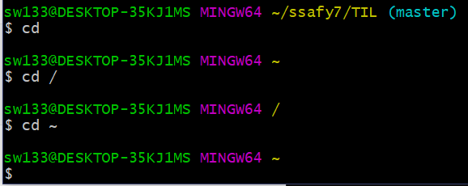


#### 경로

* 절대 경로 : 어떤 위치에서도 접근할 수 있는 경로 (모든 경로를 전부 작성) 
* 상대 경로 : 현재 작업하고 있는 디렉토리를 기준으로 계산된 상대적 경로 

> ex) 아래 트리를 기준으로 설명 A가 루트디렉토리 B가 홈디렉토리, 현재폴더를 E라고 가정
>
> M(파일)을 접근하고 싶을때 H라는 폴더에 우선 접근 해야함
>
> 절대 경로:/(or A)/D/H/M
>
> 상대 경로:../../D/H/M

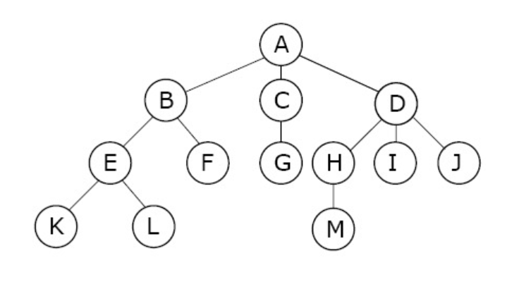

* .  :  현재 작업하는 위치 
* ..  :  현재 작업하는 위치의 상위 위치 (상위폴더/부모폴더)  


### 터미널 명령어

#### touch

* 파일 생성시 사용하는 명령어
* 기본 사용법 예시

> 아래는 touch 명령어 사용예시 코드와 결과입니다.

 ```bash
 $ touch filename.txt 
 ```

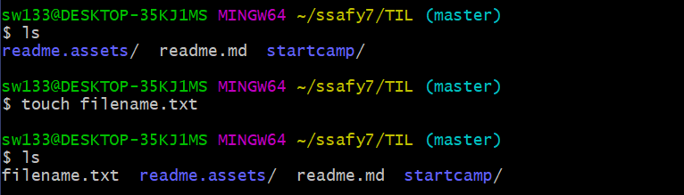


#### mkdir

* 파일(디렉토리) 생성
* 기본 사용법 예시

>  아래는 mkdir로 만들때의 예시 입니다

```bash
$ mkdir 폴더명
$ mkdir "폴 더 명" #글자를 스페이스바로 띄우고 싶을때
$ mkdir 상대경로/폴더명 #현재 위치가 아닌 다른곳에 만들고 싶을때
```

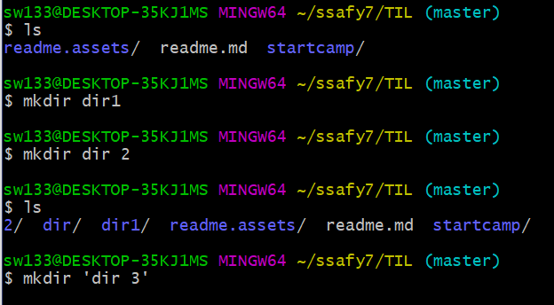

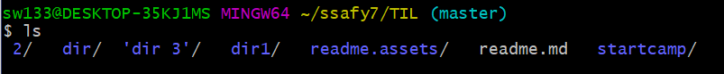

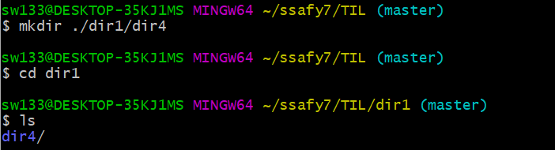


#### ls

* 현재 위치의 폴더/파일의 목록을 보고 싶을 때 사용하는 명령어
* opt
  *  **-a** : 접근 가능한 모든 폴더/파일 확인
  *  **-l** : 자세한 정보까지 확인하고 싶을 때  

>아래는 명령어 ls를 기본명령어 및 각 옵션을 달았을때의 결과물 입니다.

```bash
$ ls
$ ls -a
$ ls -l
$ ls -al
```

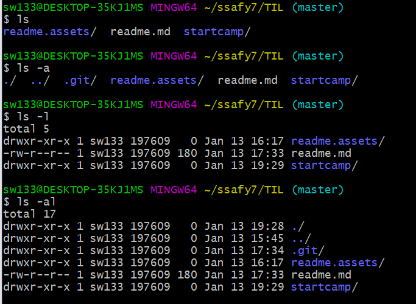


#### mv

* 파일/폴더 이동하기 , 파일/폴더 이름 변경
* 사용 예시

> 아래는 mv 명령어 사용 예시와 결과물 입니다.

``` 
$ mv 이동하려는파일명 이동시키려는위치/
$ mv 이름바꾸려는파일명 원하는이름
```

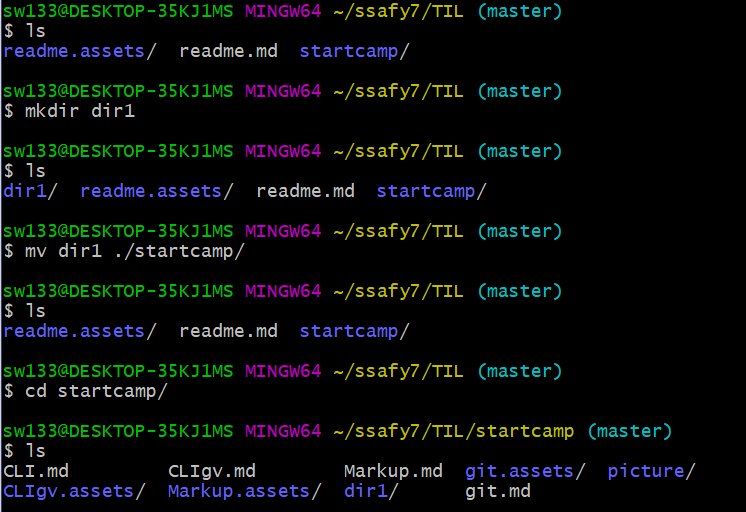


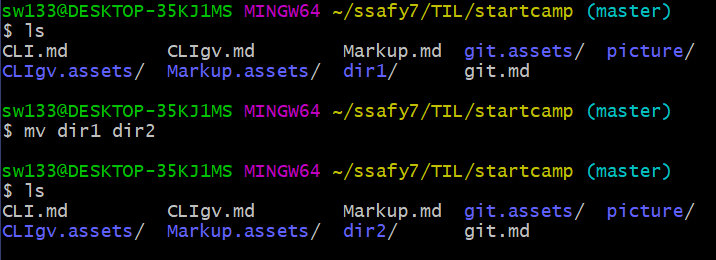


#### rm 

* 파일 삭제
* opt
  * **-r** : 내부의 모든 단말 파일까지 검색후 결정
  * **-f** : 강제력 부여
* 하나의 디렉토리를 삭제하고 싶으면 **rmdir** 명령어를 사용
* 비어있지 않은 디렉토리를 삭제하고 싶을시 **rm -r** 명령어 사용

> 아래는 rm 명령어의 예시 및 결과입니다

```bash
$ rm 지우고싶은파일명 지우고싶은파일명 ...
```

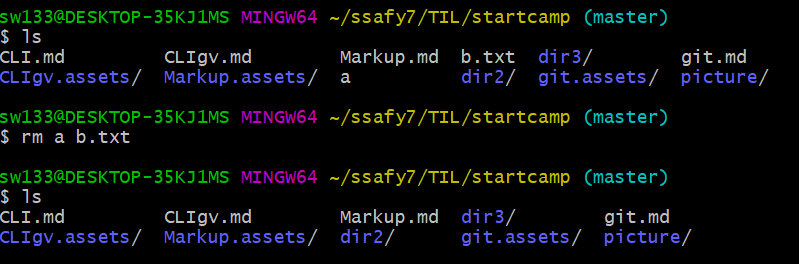

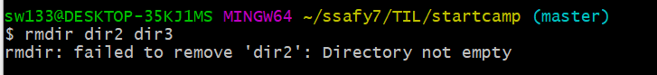

**비어있지 않은 디렉토리는 삭제불가**

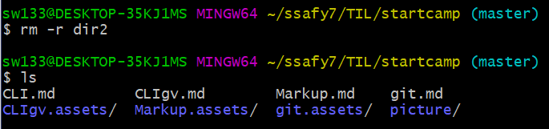


#### 기타

``` bash
ctrl + insert 복사 (ctrl+c)
shift + insert 붙혀넣기 (ctrl+v)
```

