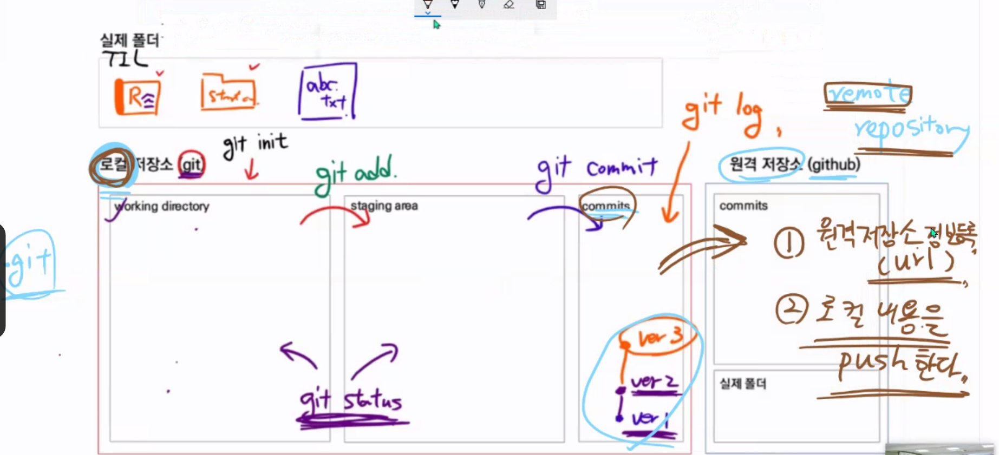

관리 하고싶으면

git init (작업폴더가 없다면 .git이 없다면)

git config --global user.email

git config --global user.name

---

working directory -> staging area

git add

워킹 디렉토리 상태

git status

staging area -> commits

git commit

커밋츠의 상태

git log

git status (말그대로 상태)

사

(staging area에 유무 차이에 따른 색깔차이)

untracked 빨간색

tracked

- modified, new - 초록색(처음 관리)
- unmodified - 파란색(기존 관리)

i 로 입력 esc 로 복귀 그후 :(콜론)으로 동작

:wq

writte, quit

first commit

이렇게 아니고 간단하게 하고 싶으면

git commit -m 'first commit' 이런식으로 사용하면 됨

remote 관련

git remote add 이름

이름이라는 이름을 가진 리모트 추가

git remote -v 

현재 등록된 리모트 정보

git remote remove 이름

존재하는 리모트 제거

