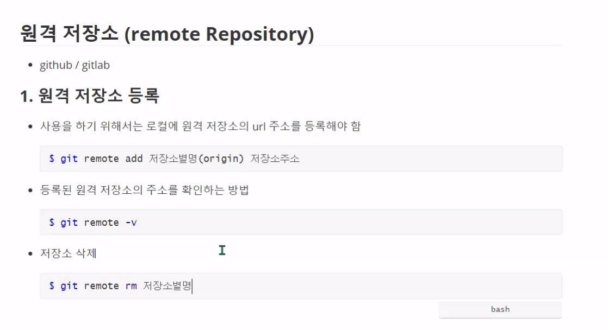
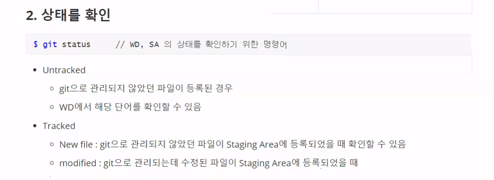
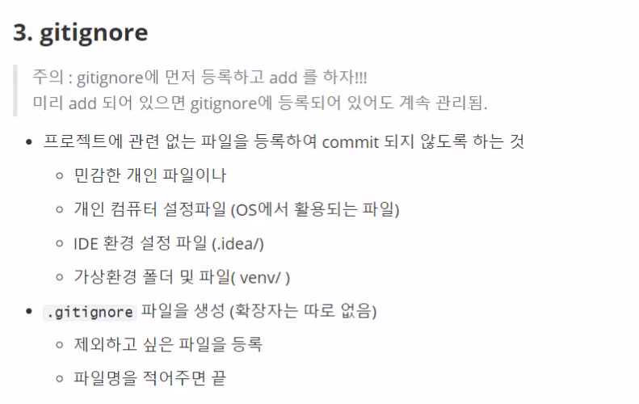
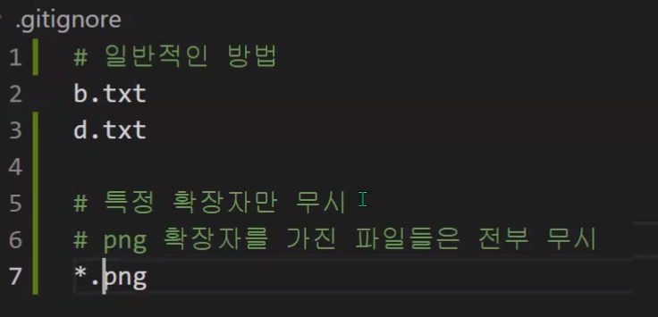
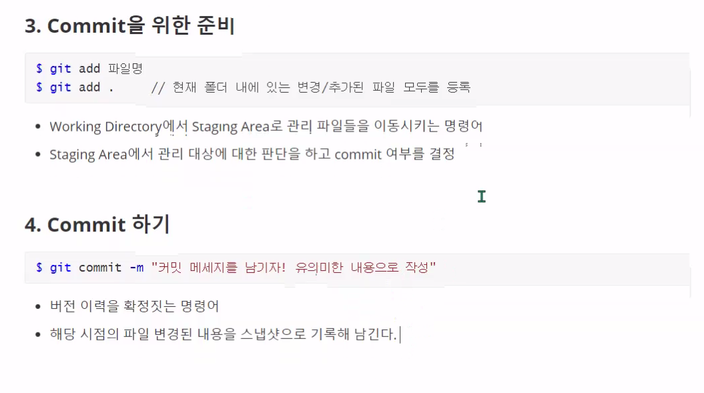
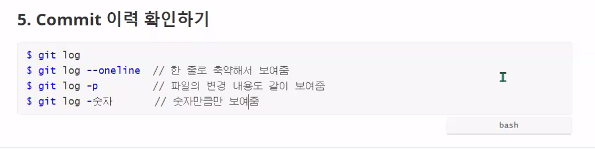
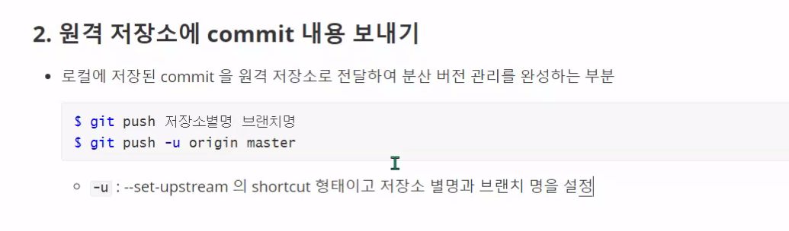
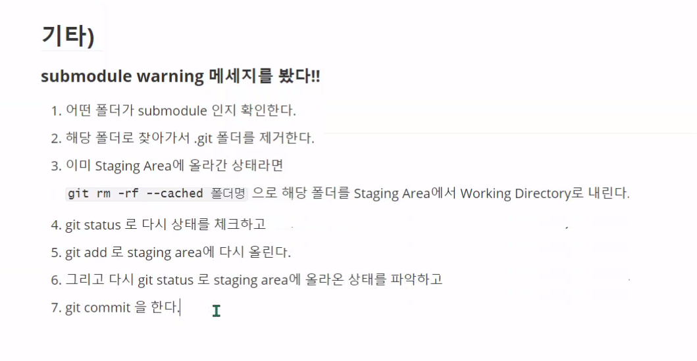

## git(hub)

> git은 분산버전관리시스템


## 구조

* ### 로컬 저장소

| Working directory                                      | Staging Area                                                 | Local Repository                                      |
| ------------------------------------------------------ | ------------------------------------------------------------ | ----------------------------------------------------- |
| 실제 작업공간<br /> 변경점이 생기면 이곳에 파일이 등록 | commit 되기전 임시로 파일들이 보여지는 곳<br /> 이곳에서 commit되어도 되는지 파일을 확인 | git으로 관리되는 파일<br /> 들의 버전들이 저장되는 곳 |


* ### 원격 저장소 (remote Repository)





















​																																				**기본적인 순서**

### 기본적인 용어

* #### local

  * 작업 디렉토리(working directory) : 실제 파일이 존재하여 말그대로 작업이 일어나는 공간
    * Untracked : 비추적, 관리x
    * Tracked : 추적 or 관리중
      * Unmodified : 수정하지않아 add, commit를 할필요도 없고 적용 대상도 아님
      * Modified : 수정을 하여 add 및 commit을 할 필요성이 있는 상태
      * Staged : add를 하여 추가적인 add는 할 필요 없이 commit만 하면 되는 상태
  * staging area : Tracked된 상태의 파일들을 관리 및 임시로 저장하는 공간
    * Staged : Tracked상태의 파일들에 git add 명령어를 사용하여 가져지는 상태
    * Unstaged : stage 밖으로 나가진 상태의 파일
  * commits : 코드의 의미있는 변경 작업들을 저장소에 기록하는 곳
    * 

* #### remote

  * commits

* 


### 준비하기

1. 윈도우에 git 설치하기. (git bash 설치)
2. 초기 설치 완료 후 로컬 컴퓨터에 **Author** 정보를 설정해야함

```bash
`*` $ git config --global user.email  //사용자 정보중 email 정보를 저장
`*` $ git config --global user.name   //사용자 정보중 이름 정보를 저장

$git config --global -l			      //설정 값 확인 명령어
```


###  사용


**처음일시 앞에 `*`가 붙으면 필요한 작업**


* `*` git init : 새로운 레포지토리 생성후 폴더에서 git을 사용하기 위한 초기화 작업

```bash
~/user 
$ git init

↓

~/user(master) 		//폴더에 숨김파일인 .git이 생김
```


---

##### 깃 원격

* `*` git remote add name : name이라는 이름의 리모트 추가

​	

#### 기본적인 흐름

1. git status : 기본적으로 commit 가능한 상태인지 판단이 가능한 정보 출력
2. git add : commit을 위하여 파일들을 관리하게 만듦(**working directory -> staging area**)
3. git status : 다시한번 확인
4. git commit : 코드의 변화를 기록하는 코드 (**staging area -> commits**)
   * git commit 후 변경사항을 적어넣는 방식 나올때는 :wq 엔터
   * git commit -m "변경 사항" 으로 하는 방식
5. git log : 커밋이 잘 되었는지 알 수 있는 정보 출력
6. git push -u '리모트이름' master


#### 기타

git remote -v : 현재 등록된 리모트 정보

git remote remove 이름 : 존재하는 리모트 제거


## 원격 저장소에서 내려받기

### 1. git clone

* `git init`, `git remote add`동작이 포함된 내려받기 명령어
* 아무것도 없는 상태일 때 사용
* 사용법

>

```bash
$ git clone remoteURL
```


### 2. git pull

*  remote 서버의 정보를 내려받는 명령어
* git 이 적용되어 있어야 함(.git 폴더가 있어야함)
* remote 정보가 등록되어 있어야함.
* 사용법

>

```bash
$ git pull branch
```


### x. 특이사항

* **submodul warning** : 어떤 폴더가 git으로 관리되고 있는데 그 폴더 하위 폴더에 git으로 관리되고 있는 폴더가 있다면 따로 관리 해줘야함.--> 레포짓터리(프로젝트)가 .git의 개수만큼 있어야함
* 
